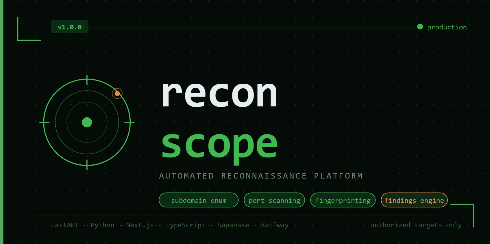

# Francoverse — Portfolio

Mi portfolio personal como desarrollador con foco en ciberseguridad. Construido con un stack moderno, animaciones fluidas y diseño minimalista oscuro.

🔗 **[francoverse.vercel.app](https://francoverse.vercel.app)**

---

## Secciones

- **Hero** — Presentación con descarga de CV y marquee de tecnologías
- **Sobre mí** — Estadísticas y experiencia
- **Proyectos** — Cards con imagen, stack tecnológico y links a demo/repo
- **Skills** — Stack tecnológico con animación de marquee
- **Contacto** — Formulario y redes sociales

---

## Stack tecnológico

| Tecnología | Uso |
|---|---|
| **Next.js** | Framework fullstack con App Router |
| **React 19** | UI con hooks y componentes funcionales |
| **TypeScript** | Tipado estático en todo el proyecto |
| **Tailwind CSS** | Estilos utilitarios y diseño responsivo |
| **Framer Motion** | Animaciones declarativas y transiciones de ruta |
| **Lucide React** | Íconos SVG |
| **next-themes** | Soporte de tema claro/oscuro |
| **React Intersection Observer** | Animaciones al entrar en viewport |
| **Vercel** | Deploy y hosting en producción |

---

## Proyectos incluidos

| Proyecto | Stack | Links |
|---|---|---|
| **API REST Securizada** | Node.js, Express, JWT, bcrypt, Railway | [Demo](https://auth-api-production.vercel.app) · [Repo](https://github.com/francovillagra/auth-api) |
| **Web Vulnerability Scanner** | Next.js, TypeScript, Axios, Recharts, Zod | [Demo](https://web-vulnerability-scanner-red.vercel.app) · [Repo](https://github.com/francovillagra/web-vulnerability-scanner) |
| **recon-scope** | Next.js, FastAPI, Python, PostgreSQL, Recharts | [Repo](https://github.com/francovillagra/recon-scope) |

---

## Correr localmente

**Prerequisitos:** Node.js 18+ y yarn

```bash
# Clonar el repositorio
git clone https://github.com/francovillagra/Francoverse.git
cd Francoverse

# Instalar dependencias
yarn install

# Modo desarrollo
yarn dev
```

Abrí [http://localhost:3000](http://localhost:3000) en tu browser.

```bash
# Build de producción
yarn build
yarn start
```

---

## Estructura del proyecto

```
Francoverse/
├── app/
│   ├── page.tsx                  # Página principal (Hero + secciones)
│   ├── layout.tsx                # Layout global
│   └── section/[section]/        # Ruta dinámica por sección
├── components/
│   ├── sections/
│   │   ├── Hero/                 # Sección hero
│   │   ├── About/                # Sobre mí y estadísticas
│   │   ├── Projects/             # ProjectsSection + ProjectCard
│   │   ├── Skills/               # SkillsSection + marquee
│   │   ├── Contact/              # Formulario y redes
│   │   └── Navigation/           # TopNav, menú móvil, ThemeToggle
│   ├── layout/                   # MainLayout, SectionContainer, wrappers
│   └── ui/                       # Button, Title, TechMarquee, ScrollNavigator, etc.
├── data/
│   └── projects.ts               # Array de proyectos y tipo Project
├── constants/
│   ├── skillsData.ts             # Skills y tecnologías
│   └── socialsData.ts            # Links a redes sociales
├── lib/                          # Utilidades, helpers de GitHub y proyectos
├── public/
│   └── projects/                 # Imágenes de los proyectos
└── types/                        # Tipos TypeScript globales
```

---

## Autor

**Franco Villagra** — Desarrollador · Ciberseguridad

- Portfolio: [francoverse.vercel.app](https://francoverse.vercel.app)
- GitHub: [@francovillagra](https://github.com/francovillagra)

---

## Licencia

MIT — libre para usar, modificar y distribuir.
